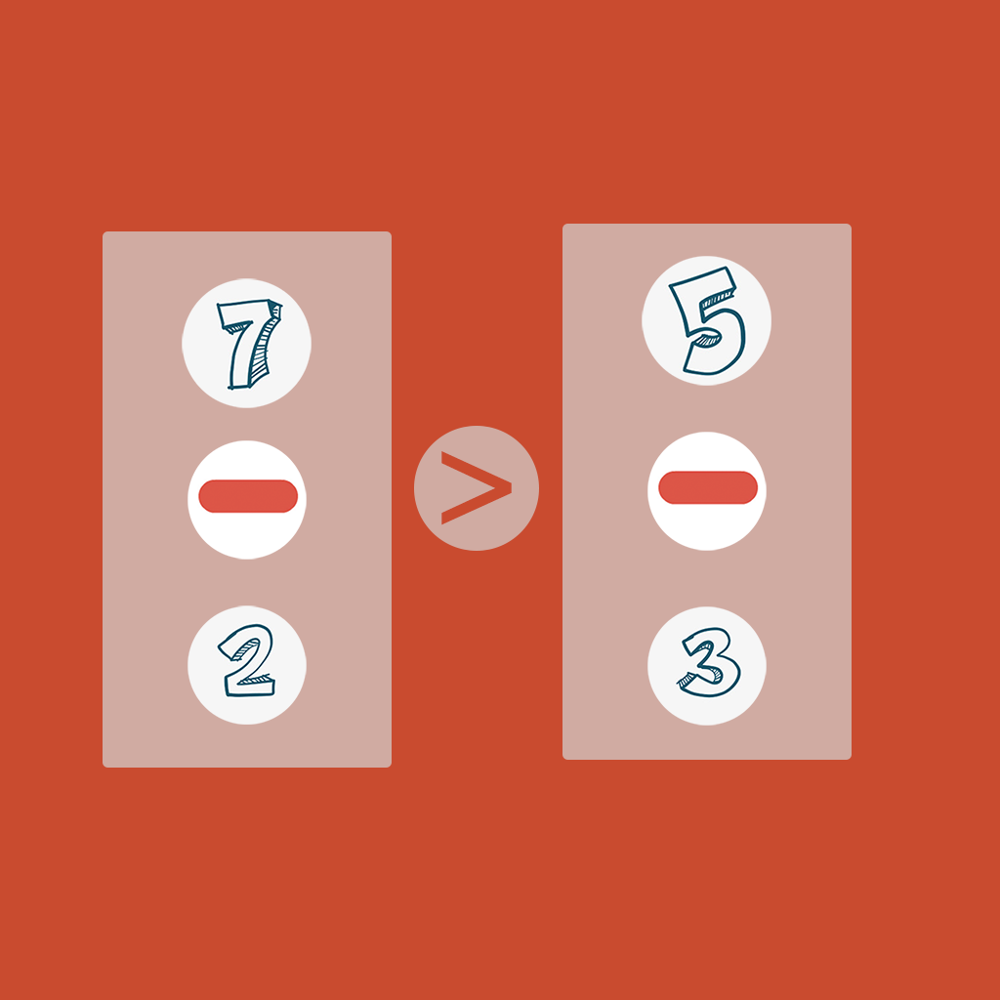

## Welcome to My Enjoyable Count Tool

This is a tool to help you practice your arithmetic ability. You can generate a number group suitable for your practice according to your ability. Each time you practice, a number will be randomly generated. You need to select an exercise number and arithmetic type from your counting group, so that the answer of the equation on the left is greater than that of the equation on the right. Each time you answer correctly, add 1 point to your score until you make a mistake, so as to help you understand and improve your arithmetic ability.

If you have any questions, you can either leave a message or send the questions to our email address.

We will answer them for you in the first time.

### Address: zhanghesongyuan7@126.com

Thank you!
